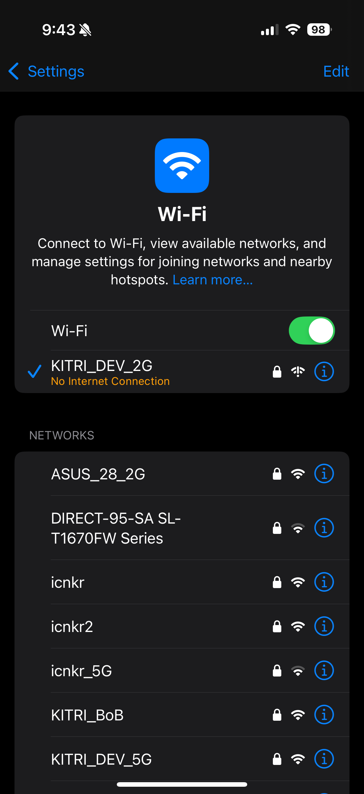

# csa-attack

## How to build

```bash
make
```

## How to use the code
```bash
syntax : csa-attack <interface> <ap mac> [<station mac>]
sample : csa-attack mon0 00:11:22:33:44:55 66:77:88:99:AA:BB
```

## Result
